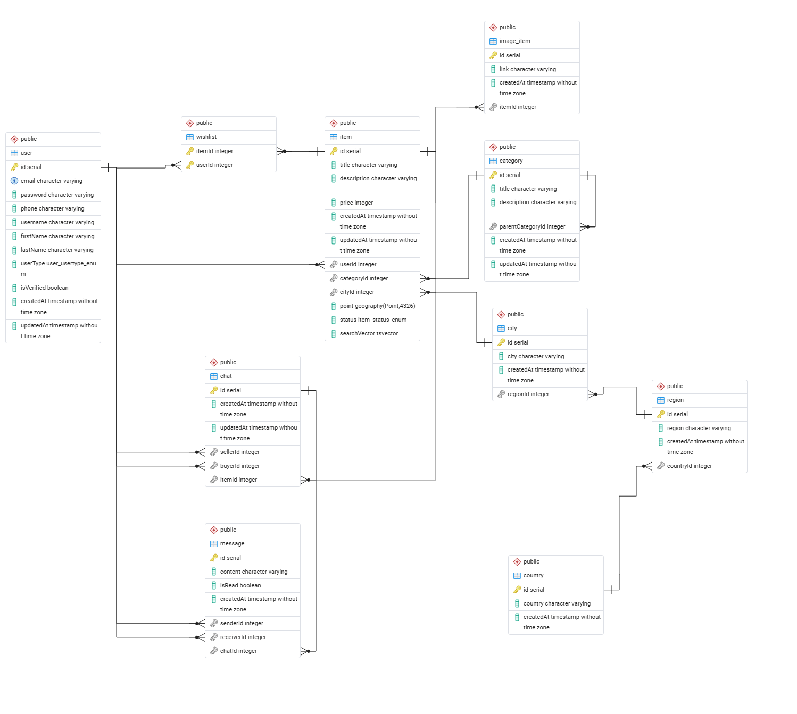

# 🏡 List Nest

🚀 **Live Server & API Documentation:** [Click here to test the live API](https://list-nest-api-production.up.railway.app/docs)

> **A comprehensive Dubizzle-like API** built for modern classifieds and marketplace platforms.
> A robust, highly optimized, and scalable backend architecture for a **Dubizzle-like** marketplace/listing platform. List Nest features advanced geospatial and full-text search, secure multi-device authentication, real-time messaging, and efficient background processing.

---

## ✨ Features

### 🔐 Authentication & Security

- **JWT & Multi-Device Sessions:** Implemented secure authentication using JWT Access and Refresh tokens. Integrated **Redis** for managing refresh tokens, enabling robust multi-device session management and remote logout capabilities.
- **HTTP-Only Cookies:** Secured refresh tokens by transmitting and managing them strictly via HTTP-only Cookies.
- **Google OAuth2:** Integrated Google OAuth2 for seamless and secure third-party login.
- **Role-Based Access Control (RBAC):** Separated Admin and regular User privileges effectively.
- **Account Security & Background Queues:** Built comprehensive account security flows (Email Verification and Password Reset) utilizing Background Queues for real-world email delivery, ensuring lightning-fast API response times and robust error tracking.
- **Verification Gates:** Enforced email verification before users are permitted to initiate chats or publish new items.
- **Rate Limiting:** Enforced throttling on sensitive endpoints (e.g., sending emails, login) to prevent brute-force and spam attacks.

### 📦 Item Management & Advanced Search

- **Optimized Search Engine:** Engineered an advanced search engine leveraging **PostgreSQL Full-Text Search** (`ts_rank`, `plainto_tsquery`) alongside Fuzzy Search capabilities using the `pg_trgm` extension to handle typos and deliver highly accurate, weighted results.
- **Geospatial Queries:** Integrated **PostGIS** for robust filtering by geographic radius and dynamically calculating exact distances (`ST_DWithin`, `ST_Distance`).
- **Multi-Layered Filtering:** Developed complex filtering and sorting capabilities including price ranges, location hierarchy (City/Region/Country), hierarchical categories, and custom relevance scoring.
- **Dynamic Status Workflow:** Designed an item status workflow (Draft, Active, Sold, Expired) with seamless pagination for large datasets.
- **Serverless Image Uploads:** Engineered a direct-to-**Cloudinary** signed URLs architecture, drastically reducing server bandwidth and load.
- **Cascading Asynchronous Deletion:** Deleting an item or user account automatically dispatches background queue tasks to permanently wipe associated image assets from Cloudinary, maintaining strict storage hygiene.
- **Automated Cron Jobs (`@nestjs/schedule`):**
  - Automatically expire outdated active/sold ads to keep the feed fresh.
  - Purge abandoned draft items after 24 hours.
  - Run a nightly synchronization script to detect and permanently delete orphaned/unused images from Cloudinary, minimizing cloud storage costs.

### 🗂️ Categories System

- **Hierarchical Management:** Engineered a structured category system supporting Parent and Subcategory relationships, secured with Admin-only access.
- **Optimized Client Filtering:** Linked items to specific categories to enable highly optimized and rapid querying on the client side.

### ❤️ Wishlist Functionality

- **User Favorites:** Created a system allowing users to save and unsave favorite items.
- **Efficient Fetching:** Optimized queries to fetch user-specific saved items rapidly.

### 💬 Real-Time Chat & Messaging System

- **WebSockets (`Socket.io`):** Engineered a real-time messaging system enabling seamless communication between buyers and sellers.
- **Secured Connections:** Protected WebSocket connections using custom JWT Authentication Guards and Rate Limiting to prevent unauthorized access and message spamming.
- **Strict Room Authorization:** Enforced domain-level authorization for private chat rooms, ensuring only the specific item's seller and the initiating buyer can join or read the conversation.
- **Hybrid Architecture:** Combined HTTP REST APIs for a paginated Inbox and "mark as read" functionality with WebSockets for instant message delivery.

---

## 🗄️ Database Schema (ERD)

The database is carefully designed to support complex relationships, hierarchical data, and geospatial queries. Below is the Entity-Relationship Diagram representing the core architecture, including the hierarchical location system, self-referencing categories, and the real-time chat structure.

---

## 🏗️ Architecture & Code Quality

- **OOP & Dependency Injection:** Strictly adhered to Object-Oriented Programming and DI principles using **NestJS**.
- **Payload Validation:** Utilized Data Transfer Objects (DTOs) and `class-validator` for rigorous data validation.
- **Interactive Documentation:** Auto-generated complete, interactive API documentation using **Swagger UI**.

---

## 🛠️ Tech Stack

### Core & Framework

- **Environment:** Node.js
- **Framework:** NestJS (TypeScript)

### Database & Storage

- **Database:** PostgreSQL
- **ORM:** TypeORM
- **Extensions:** PostGIS (Geospatial routing), `pg_trgm` (Fuzzy search)
- **Media Storage:** Cloudinary (Serverless signed-URL uploads)

### Caching, Background Jobs & Real-time

- **Caching & Sessions:** Redis
- **Message Broker/Queues:** Bull/BullMQ (Async email delivery and asset cleanup)
- **Real-time Engine:** Socket.io (WebSockets)

### Security & DevOps

- **Security Auth:** Passport.js (Local, JWT, Google OAuth20), bcrypt, HTTP-Only Cookies
- **API Security:** Custom WebSocket Guards, API Rate Limiting (Throttler)
- **Documentation:** Swagger UI (OpenAPI) - Single source of truth for REST and WebSockets.
- **DevOps:** Docker (Containerization), Railway (Production Deployment)

---

## 📖 API Documentation (Swagger)

The API is fully documented using Swagger UI, serving as the single source of truth for both REST endpoints and WebSockets event structures.

**🌍 Live Environment:**
You can access and interact with the live deployed API documentation here:
👉 **[List Nest Live API Docs](https://list-nest-api-production.up.railway.app/docs)**

**💻 Local Environment:**
If you are running the application locally, the documentation is available at:
👉 `http://localhost:3000/api/docs`
